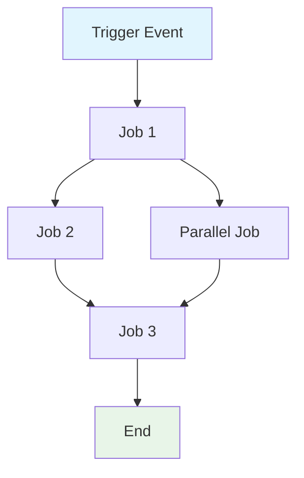
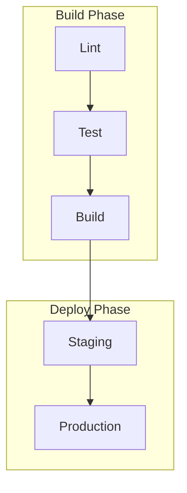

# GitHub Actions ワークフロー仕様の作成

`${input:WorkflowFile}` の GitHub Actions ワークフローについて、包括的な仕様を作成してください。

この仕様は、ワークフローの振る舞い・要件・制約を定義するものです。実装非依存であること（「どのように」ではなく「何を」達成するかに集中）を厳守してください。

## AI 最適化要件

- トークン効率: 簡潔さを保ちつつ、明瞭さを損なわない
- 構造化データ: 表、箇条書き、図を活用して情報密度を高める
- セマンティック一貫性: 用語を正確かつ継続的に使用する
- 実装抽象化: 具体的な構文・コマンド・ツールバージョンは避ける
- 保守性: 進化に合わせて容易に更新できる設計にする

## 仕様テンプレート

保存先: `/spec/spec-process-cicd-[workflow-name].md`

```md
---
title: CI/CD Workflow Specification - [Workflow Name]
version: 1.0
date_created: [YYYY-MM-DD]
last_updated: [YYYY-MM-DD]
owner: DevOps Team
tags: [process, cicd, github-actions, automation, [domain-specific-tags]]
---

## ワークフロー概要

**目的**: [ワークフローの主目的を1文で]
**トリガーイベント**: [トリガー条件の一覧]
**対象環境**: [適用スコープ]

## 実行フローダイアグラム



## ジョブと依存関係

| ジョブ名 | 目的 | 依存関係 | 実行コンテキスト |
|----------|------|----------|-------------------|
| job-1 | [目的] | [前提条件] | [Runner/Environment] |
| job-2 | [目的] | job-1 | [Runner/Environment] |

## 要件マトリクス

### 機能要件
| ID | 要件 | 優先度 | 受け入れ基準 |
|----|------|--------|----------------|
| REQ-001 | [要件] | High | [検証可能な基準] |
| REQ-002 | [要件] | Medium | [検証可能な基準] |

### セキュリティ要件
| ID | 要件 | 実装上の制約 |
|----|------|--------------|
| SEC-001 | [セキュリティ要件] | [制約の説明] |

### パフォーマンス要件
| ID | 指標 | 目標 | 測定方法 |
|----|------|------|----------|
| PERF-001 | [メトリック] | [目標値] | [測定方法] |

## 入出力コントラクト

### 入力

```yaml
# 環境変数
ENV_VAR_1: string  # 目的: [説明]
ENV_VAR_2: secret  # 目的: [説明]

# リポジトリトリガー
paths: [パスフィルターの一覧]
branches: [ブランチパターンの一覧]
```

### 出力

```yaml
# ジョブ出力
job_1_output: string  # 説明: [目的]
build_artifact: file  # 説明: [内容の種類]
```

### シークレットと変数

| 種別 | 名称 | 目的 | スコープ |
|------|------|------|----------|
| Secret | SECRET_1 | [目的] | Workflow |
| Variable | VAR_1 | [目的] | Repository |

## 実行制約

### ランタイム制約

- タイムアウト: [最大実行時間]
- 併行実行: [並列実行の上限]
- リソース制限: [メモリ/CPU 制約]

### 環境制約

- ランナー要件: [OS/ハードウェア要件]
- ネットワークアクセス: [外部接続の必要性]
- 権限: [必要なアクセスレベル]

## エラーハンドリング戦略

| エラー種別 | 応答 | 復旧アクション |
|------------|------|-----------------|
| ビルド失敗 | [応答] | [復旧手順] |
| テスト失敗 | [応答] | [復旧手順] |
| デプロイ失敗 | [応答] | [復旧手順] |

## クオリティゲート

### ゲート定義

| ゲート | 基準 | 迂回条件 |
|--------|------|----------|
| コード品質 | [基準] | [許容条件] |
| セキュリティスキャン | [閾値] | [許容条件] |
| テストカバレッジ | [割合] | [許容条件] |

## モニタリングと可観測性

### 主要メトリクス

- 成功率: [目標割合]
- 実行時間: [目標時間]
- リソース使用率: [監視アプローチ]

### アラーティング

| 条件 | 重要度 | 通知先 |
|------|--------|--------|
| [条件] | [レベル] | [対象/場所] |

## 連携ポイント

### 外部システム

| システム | 連携種別 | データ交換 | SLA 要件 |
|----------|----------|------------|----------|
| [System] | [Type] | [Data format] | [Requirements] |

### 依存ワークフロー

| ワークフロー | 関係 | トリガー方式 |
|--------------|------|--------------|
| [Workflow] | [Type] | [How triggered] |

## コンプライアンスとガバナンス

### 監査要件

- 実行ログ: [保持方針]
- 承認ゲート: [必要な承認]
- 変更管理: [更新プロセス]

### セキュリティコントロール

- アクセス制御: [権限モデル]
- シークレット管理: [ローテーション方針]
- 脆弱性スキャン: [実施頻度]

## エッジケースと例外

### シナリオマトリクス

| シナリオ | 期待動作 | 検証方法 |
|----------|----------|----------|
| [エッジケース] | [動作] | [検証方法] |

## 検証基準

### ワークフロー検証

- VLD-001: [検証ルール]
- VLD-002: [検証ルール]

### パフォーマンス指標

- PERF-001: [ベンチマーク基準]
- PERF-002: [ベンチマーク基準]

## 変更管理

### 更新プロセス

1. 仕様更新: まず本書を更新する
2. レビューと承認: [承認プロセス]
3. 実装: ワークフローへ変更を適用
4. テスト: [検証アプローチ]
5. デプロイ: [リリース手順]

### バージョン履歴

| Version | Date | Changes | Author |
|---------|------|---------|--------|
| 1.0 | [Date] | Initial specification | [Author] |

## 関連仕様

- [関連ワークフロー仕様へのリンク]
- [インフラ仕様へのリンク]
- [デプロイ仕様へのリンク]

```

## 解析手順

ワークフローファイルを解析する際は、以下に従ってください。

1. 主要目的の抽出: ビジネス上の主目的を特定
2. ジョブフローのマッピング: 実行順序を示す依存関係グラフの作成
3. コントラクトの特定: 入力・出力・インターフェイスの文書化
4. 制約の把握: タイムアウト・権限・リソース制限の抽出
5. クオリティゲート定義: 検証点と承認点の特定
6. エラーパスの文書化: 失敗シナリオと復旧手順のマッピング
7. 実装抽象化: 構文ではなく振る舞いに着目

## Mermaid 図のガイドライン

### フロー種別
- 直列: `A --> B --> C`
- 並列: `A --> B & A --> C; B --> D & C --> D`
- 分岐: `A --> B{Decision}; B -->|Yes| C; B -->|No| D`

### スタイリング
```mermaid
style TriggerNode fill:#e1f5fe
style SuccessNode fill:#e8f5e8
style FailureNode fill:#ffebee
style ProcessNode fill:#f3e5f5
```

### 複雑なワークフロー
5 つ以上のジョブがある場合はサブグラフを使用:


## トークン最適化戦略

1. 表の活用: 構造化により情報密度を高める
2. 略語の一貫使用: 一度定義し、以後使い回す
3. 箇条書き: 散文ではなくポイントで記述
4. コードブロック: 物語ではなく構造化データを優先
5. 参照: 繰り返しではなくリンクで連携

この仕様は、ドキュメントであると同時にワークフロー更新のテンプレートとして機能することを目指してください。
