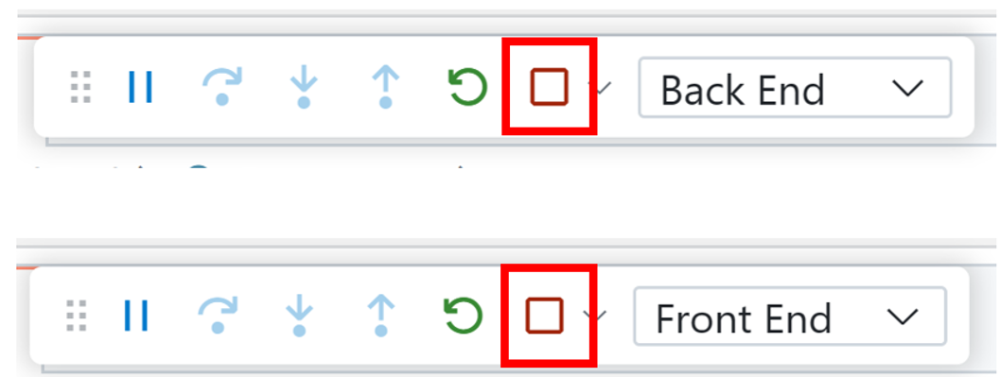

# MemoFee

A personal RSS/Atom feed reader with note-taking capabilities built with .NET 8 and Blazor Web App.

## Overview

MemoFee allows you to:
- Register and manage RSS/Atom feeds
- Browse and search articles from your feeds
- Add personal notes, tags, and stars to articles
- Secure single-user access via Azure App Service Easy Auth

## Features

- **RSS/Atom Support**: Works with any standard RSS or Atom feed
- **Personal Notes**: Add rich text notes to any article
- **Tagging System**: Organize articles with custom tags
- **Star Articles**: Mark important articles for easy access
- **Search & Filter**: Find articles by title, content, tags, or feed
- **Single User**: Designed for personal use with Azure authentication
- **Azure Ready**: Built for deployment to Azure App Service

## Technology Stack

- **.NET 8**: Latest .NET framework
- **Blazor Web App**: Server-side rendering with interactivity
- **Entity Framework Core**: SQL Server database
- **Azure App Service**: Hosting platform
- **Easy Auth**: Azure App Service Authentication
- **Bootstrap 5**: UI framework
- **RSS/Atom Parsing**: System.ServiceModel.Syndication

## Quick Start

1. **Clone the repository**
   ```bash
   git clone <repository-url>
   cd memofee
   ```

2. **Build and run locally**
   ```bash
   dotnet build
   dotnet run --project src/Memofee.AppHost
   ```

3. **Access the application**
   - Open your browser to `https://localhost:5001`
   - Add your first RSS/Atom feed
   - Start browsing and noting articles

## Configuration

### Database

The application uses SQL Server with Entity Framework Core. Update the connection string in `appsettings.json`:

```json
{
  "ConnectionStrings": {
    "DefaultConnection": "Server=(localdb)\\mssqllocaldb;Database=MemoFee;Trusted_Connection=true;MultipleActiveResultSets=true"
  }
}
```

### Authentication

For single-user access, configure the allowed user:

```json
{
  "ALLOWED_UPN": "your-email@domain.com",
  "ALLOWED_OID": "your-azure-object-id"
}
```

**Environment Variables for Production:**
- `ALLOWED_UPN`: User Principal Name (email) of the authorized user
- `ALLOWED_OID`: Azure AD Object ID of the authorized user (alternative to UPN)
- `ConnectionStrings__DefaultConnection`: Database connection string

### Azure Deployment

1. **Create Azure Resources**:
   - Azure App Service (Linux recommended)
   - Azure SQL Database
   - Enable App Service Authentication

2. **Configure App Service Authentication**:
   - Enable Microsoft account or Azure AD authentication
   - Configure redirect URLs

3. **Set Application Settings**:
   - `ALLOWED_UPN` or `ALLOWED_OID`: Your authorized user identifier
   - `ConnectionStrings__DefaultConnection`: Azure SQL connection string

4. **Deploy**:
   ```bash
   dotnet publish -c Release
   # Deploy to Azure App Service
   ```

## API Endpoints

### Feeds
- `GET /api/feeds` - List all feeds
- `POST /api/feeds` - Add new feed
- `DELETE /api/feeds/{id}` - Delete feed
- `POST /api/feeds/{id}/refresh` - Refresh feed

### Articles
- `GET /api/articles` - List articles (with search/filter)
- `GET /api/articles/{id}` - Get article details

### Notes
- `GET /api/articles/{articleId}/notes` - Get notes for article
- `PUT /api/articles/{articleId}/notes` - Create/update note
- `DELETE /api/articles/{articleId}/notes/{noteId}` - Delete note

## Development

### Prerequisites
- .NET 8 SDK
- SQL Server (LocalDB for development)
- Visual Studio 2022 or VS Code

### Project Structure
```
src/
├── Memofee/                 # Main Blazor Web App
│   ├── Components/          # Blazor components
│   ├── Data/               # Entity Framework DbContext
│   ├── Models/             # Data models
│   ├── Services/           # Business logic services
│   └── Dtos/               # Data transfer objects
├── Memofee.Client/         # Blazor WebAssembly client
├── Memofee.AppHost/        # .NET Aspire orchestrator
└── Memofee.ServiceDefaults/ # Shared configurations

tests/
├── Memofee.Tests/          # Unit tests
└── Memofee.AppHost.Tests/  # Integration tests
```

### Database Migrations

```bash
# Add migration
dotnet ef migrations add InitialCreate --project src/Memofee

# Update database
dotnet ef database update --project src/Memofee
```

## Security

- **Single User Access**: Application enforces single-user access via UPN/OID validation
- **HTTPS Only**: All communication forced over HTTPS
- **Azure Authentication**: Leverages Azure App Service Easy Auth
- **No PII Storage**: Minimal personal information stored beyond authentication

## Contributing

1. Fork the repository
2. Create a feature branch
3. Make your changes
4. Add tests if applicable
5. Submit a pull request

## License

This project is licensed under the MIT License - see the LICENSE file for details.

---

Built with ❤️ using .NET 8 and Blazor

---

# GitHub Codespaces ♥️ .NET

Want to try out the latest performance improvements coming with .NET for web development? 

This repo builds a Weather API, OpenAPI integration to test with [Scalar](https://learn.microsoft.com/aspnet/core/fundamentals/openapi/using-openapi-documents?view=aspnetcore-9.0#use-scalar-for-interactive-api-documentation), and displays the data in a web application using Blazor with .NET. 

We've given you both a frontend and backend to play around with and where you go from here is up to you!

Everything you do here is contained within this one codespace. There is no repository on GitHub yet. If and when you’re ready you can click "Publish Branch" and we’ll create your repository and push up your project. If you were just exploring then and have no further need for this code then you can simply delete your codespace and it's gone forever.

### Run Options

[](https://codespaces.new/github/dotnet-codespaces)
[](https://vscode.dev/redirect?url=vscode://ms-vscode-remote.remote-containers/cloneInVolume?url=https://github.com/github/dotnet-codespaces)

You can also run this repository locally by following these instructions: 
1. Clone the repo to your local machine `git clone https://github.com/github/dotnet-codespaces`
1. Open repo in VS Code

## Getting started

1. **📤 One-click setup**: [Open a new Codespace](https://codespaces.new/github/dotnet-codespaces), giving you a fully configured cloud developer environment.
2. **▶️ Run all, one-click again**: Use VS Code's built-in *Run* command and open the forwarded ports *8080* and *8081* in your browser. 


3. The Blazor web app and Scalar can be open by heading to **/scalar** in your browser. On Scalar, head to the backend API and click "Test Request" to call and test the API. 


4. **🔄 Iterate quickly:** Codespaces updates the server on each save, and VS Code's debugger lets you dig into the code execution.

5. To stop running, return to VS Code, and click Stop twice in the debug toolbar. 




## Contributing

This project welcomes contributions and suggestions.  Most contributions require you to agree to a
Contributor License Agreement (CLA) declaring that you have the right to, and actually do, grant us
the rights to use your contribution. For details, visit https://cla.opensource.microsoft.com.

When you submit a pull request, a CLA bot will automatically determine whether you need to provide
a CLA and decorate the PR appropriately (e.g., status check, comment). Simply follow the instructions
provided by the bot. You will only need to do this once across all repos using our CLA.

This project has adopted the [Microsoft Open Source Code of Conduct](https://opensource.microsoft.com/codeofconduct/).
For more information see the [Code of Conduct FAQ](https://opensource.microsoft.com/codeofconduct/faq/) or
contact [opencode@microsoft.com](mailto:opencode@microsoft.com) with any additional questions or comments.

## Trademarks

This project may contain trademarks or logos for projects, products, or services. Authorized use of Microsoft 
trademarks or logos is subject to and must follow 
[Microsoft's Trademark & Brand Guidelines](https://www.microsoft.com/en-us/legal/intellectualproperty/trademarks/usage/general).
Use of Microsoft trademarks or logos in modified versions of this project must not cause confusion or imply Microsoft sponsorship.
Any use of third-party trademarks or logos are subject to those third-party's policies.
